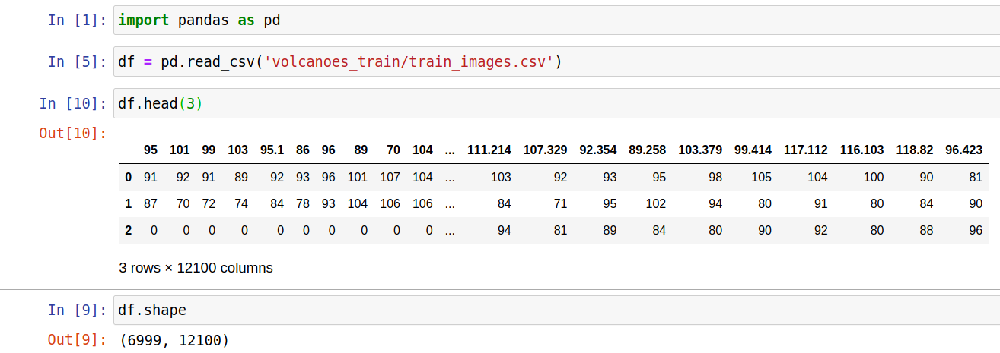
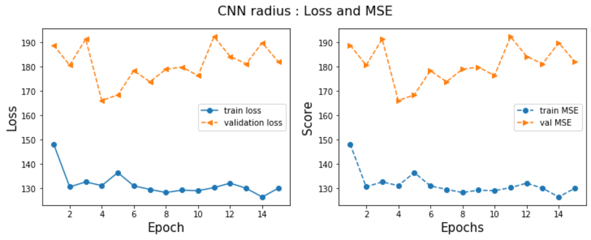
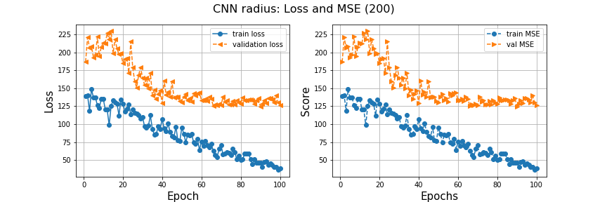
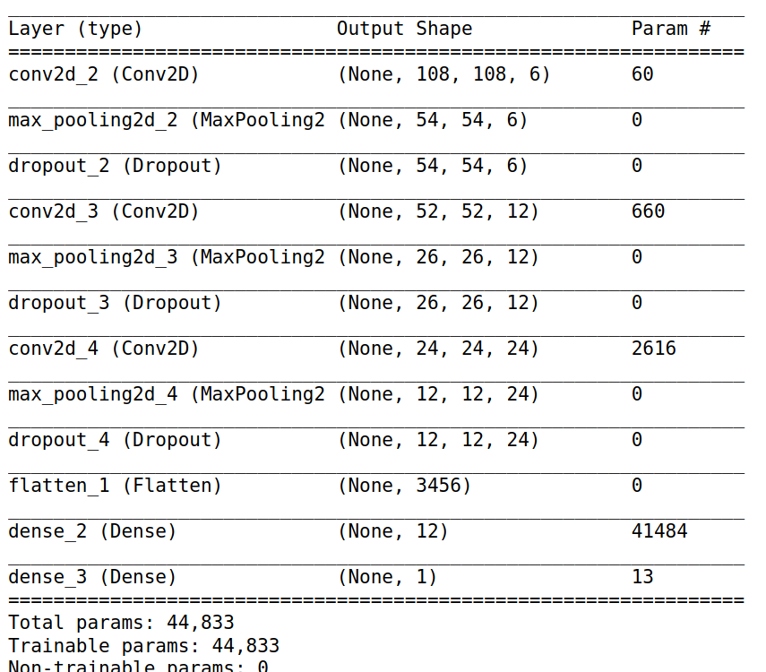
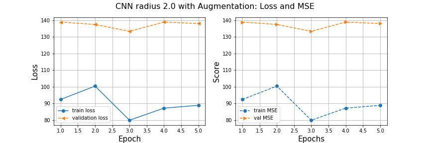

# Classifying and Measuring Volcanoes with Convolutional Neural Networks

 ## **The Data**
 This dataset contains images collected by the Magellan expedition to Venus. Venus is the
 most similar planet to the Earth in size, and therefore researchers want to learn about 
its geology. Venus' surface is scattered with volcanos, and this dataset aimed to develop
 a program that can automatically identify volcanoes (from training data that have been 
labeled by human experts between 1-with 98% probability a volcano- and 4-with 50% 
probability)br>
link to data: https://www.kaggle.com/fmena14/volcanoesvenus?</br>

Images from this data source come in a CSV of 7000 flattened images with 12100 pixels each with labels as followed:</br>

**Labels**<br>
```Volcano?``` : Wether images is of a volcano or not { binary }<br>
```Type``` : 1= defin itely a volcano, 2 =probably, 3= possibly, 4= onlya pit is visible { float }</br>
```Radius```: The radius of the volcano in the center of the image, in pixels { float }<br>
```Number Volcanoes```: The number of volcanoes in the image { float }
<br>


<!-- </br> -->
**Can you tell if there is a volcano in these images?**<br>
</br> 
As you can see, The images can be very hard to distinguish by eye. There are relatively few planetary geologists specializing in the surface of venues. 
I hope to make a model that can classify whether there is a volcano in these images so that few experts can get right to the business of studying volcanoes 
without having to sift through and label images first.

<!-- --></br>
## **Binary Classification: Volcano or Not?**
**Class Imbalance check**</br>
During EDA I checked to see how the volcano or not volcano labels are distributed. <br> 
</br>This shows a class imbalance with a ratio of 1:6 positives class. I will first try to make a model without correcting for class imbalance and see how it scores. I will pay close attention to the ratio of False negatives to False positives to make sure my model does not mislead the planetary geologists by under predicting the minority class. </br>

## **Binary Classification: Volcano or Not?****Class Imbalance check**</br>During 
**Archatecture**</br>The first architecture I tried is shown below:<br>
I used relu activation for each layer except the last were I used sigmoid. I also chose an adam optimizer and loss function of binary cross entropy. The learning curve is as follows:<br>
<br>
The loss looks good with this model but the accuracy looked Pretty constant. Instead of letting it fit another time with more epochs, I decided to go ahead and modify the architecture. <br>
I went through a few iterations of architecture, adding drop out to prevent overfitting, and adding more filters until I came up with an architecture I was happy with.<br>EDA I checked to see how the volcano or not volcano labels are distributed. <br> </br>This shows a class imbalance with a ratio of 1:6 positives class. I will first try to make a model without correcting for class imbalance and see how it scores. I will pay close attention to the ratio of False negatives to False positives to make sure my model does not mislead the planetary geologists by under predicting the minority class.

The architecture I found to work very well is as follows:</br>
```filters:```6 on first layer, 12 on second layer<br>
```filter size:``` 3x3 pixles <br>
```activation:``` relu except for the last dence layer which was sigmoid<br>
```pooling```: MAx pooling (2x2)<br>
```stride size for convolutions```: 2<br>
```Regularization```: Drop out of .5 on the two convolutions<br>
```flattened steps```: after flattening 2 fully connected layers were used with the fisrt one having 12 nodes and the last having 1<br>

</br>

**Learning Rate**<br>
I fit this model, which I will call CNN3, with 15 epochs. Here is a plot of the learning rate:</br>
</br>

The loss and accuracy seem to peak out around 12 epochs. The validation accuracy seems to be very good and the loss seems to be minimized so i will evaluate my model with my hold out data. <br>


### **Predictions On Hold Out Data With Binary Classification CNN**

>**Accuracy with Holdout data =  .93 !!**<br>

Looking at a sample of hold out images we can see how well the CNN was able to pick up on signs of volcanoes that in some cases is very hard to see with the eye. 
<br>
The white annotaion is the predicted probability of the presence of at least one volcano. The default threshold of .5 was used in the training of the model. We can see from the histogram of predicted probabilities and the confusion matrix below, that that default value will work very well with our choice of sigmoid output layer. 


**Confusion Matrix**<br>
<br>
This confusion matrix looks very good considering 83% of the hold out images are labeled to have no volcano.  There is a slghtly higher percentage of false negatives then false positives with this model. More false negatives may be a problem if the scientists looking to study these images does do not want to miss any volcanoes and would rather have some negative images then miss a positive. But if this classification was being done as a preporation for further space missions, you would want the false positives to be lower then false negatives becasue it is extremely expensive and time consumming to do any space missions so you would not want to send them to a volcao that  is not there.


### **Conculsion for the binary approch**<br>
Even with a class imbalence and a shallow convolutional neural network architecture, this model was able to predict the hold out data with 93% accuracy. Depending on the use of this model the threashold for predicting could be shifted to control the FN/FP ratio if desired.


______________
## **Recognizing the the radius of a volcano**

A target column wis given in the dataset that is the radius in pixel of single volcano images. In this section I will use the same architecture as the the binary classification CNN to predict the radius of a volcano captured during the Magellan expadition. <br>

**To convert the model to predict a continouse range of numbers I made the following changes:**<br>
- The output dense layer has a linear activation function so that the output can be any number. 
- Loss function is mean squared error, and metric for evaluation is mean squared error.

I first filted the data set to only samples that have a radius measurment. This brought the sample size down to 1000 samples. I will leave this small for now to see how the CNN performes. Below is a histogram of radii showing two clear sizes of volcano a majority type that are roughly 40 pixels across and a minority that are small, at about 10 pixels across. <br>
<br>

On the first training run of this CNN with this dataset I ran it for the same amount of epochs that I used to train this similar architecture for binary classification. It showed not much learning:<br>
<br>

I decided to run for many more epochs to see if this would eventually bring my MSE down.  <br>

Below is a plot of the fisrt 100. <br>
<br>
It looks like the MSE may still come down so I fit again with 100 more epochs:<br>

 <br>
 After over 200 epochs with this same architecture it seems that the validation MSE is going up and the train MSE is going down. To try and get my MSE lower I would like to make a deeper CNN and augmentation to  the training set.

 ### **Training a Deeper CNN** <br>
 I used the same architecture as before but added an additional layer of convultion, pooling and drop out. The arechitecture is shown below.<br>
 <br>

 Below is a plot of the Loss and MSE of 200 epochs with this deeper CNN.<br>
 <br>
 This modified architecture does not seem to by getting the MSE to move in a better direction. It still bottoms out at about 140. Instead of Running for hundreds of more epochs or makingthe network deeper at this time I try and do some aumentation of training images.


### **Adding Augmentation**<br>
Image augmentation is a way to give the training set more variation. In theory it helps with over fitting and general improvement of a model's prediction ability.<br>

I wrote a generator function that would take batches of images and as the fed into the CNN are given a fifty fifty chance of being flip horazontaly, flipped verticaly, and randomly cropped. Below is a sample of the augmentation an image may go through. <br> 
<br>

Adding the augmentation generator to the input of the CNN **drastically** increased the fitting speed. Because of the time contrains on this project I decided to just pick two of the augmentation options, flip horazontally and crop, let if fit. <br>
Below is a plot of 5 epochs of training with augmentation. This new training was done ontop of the training in the previous section. 



### **Predict radius on holdout data**


________
# Conclution
 - A vary simple CNN did a great job at predicting the presence of a volcano in an image at least compaired to the profeesional labelers. 
 - Depending on the use of this prediction model a threshold couls be chosen to favor less false positives or less false negatives.
 - The same architecture and training time did very poorly when adapted for use as a regression model. 
 - *something on prediction regression*
 - Given more time I would try the following


