# Identifying Volcanoes with Convolutional Neural Networks

 ## **The Data**
 This dataset contains images collected by the Magellan expedition to Venus. Venus is the
 most similar planet to the Earth in size, and therefore researchers want to learn about 
its geology. Venus' surface is scattered with volcanos, and this dataset aimed to develop
 a program that can automatically identify volcanoes (from training data that have been 
labeled by human experts between 1-with 98% probability a volcano- and 4-with 50% 
probability)br>
link to data: https://www.kaggle.com/fmena14/volcanoesvenus?</br>

Images from this data source come in a CSV of 7000 flattened images with 12100 pixels each with labels as followed:</br>

**Labels**<br>
```Volcano?``` : Wether images is of a volcano or not { binary }<br>
```Type``` : 1= defin itely a volcano, 2 =probably, 3= possibly, 4= onlya pit is visible { float }</br>
```Radius```: The radius of the volcano in the center of the image, in pixels { float }<br>
```Number Volcanoes```: The number of volcanoes in the image { float }
<br>


<!-- </br> -->
**Can you tell if there is a volcano in these images?**<br>
</br> 
As you can see, The images can be very hard to distinguish by eye. There are relatively few planetary geologists specializing in the surface of venues. 
I hope to make a model that can classify whether there is a volcano in these images so that the few experts can get right to the business of studying volcanoes
without having to sift through and label images first.

<!-- --><br>

## **Binary Classification: Volcano or Not?**
**Class Imbalance check**</br>
During EDA I checked to see how the volcano or not volcano labels are distributed. <br> 
</br>The histogram above shows a class imbalance with a ratio of 1:6 positives class. I will first try to make a model without correcting for class imbalance and see how it scores. I will pay close attention to the ratio of False negatives to False positives to make sure my model does not mislead the planetary geologists by under predicting the minority class. </br>

**Archatecture**</br>The first architecture I tried is shown below: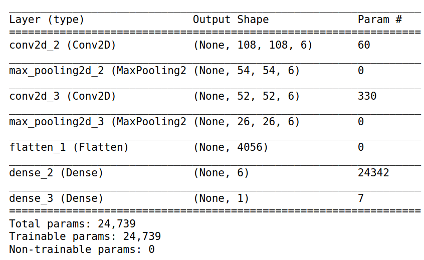<br>
I used relu activation for each layer except the last were I used sigmoid. I also chose an adam optimizer and loss function of binary cross entropy. The learning curve is as follows:<br>
<br>
The loss looks good with this model but the accuracy looked Pretty constant. Instead of letting it fit another time with more epochs, I decided to go ahead and modify the architecture. <br>
I went through a few iterations of architecture, adding drop out to prevent overfitting, and adding more filters until I came up with an architecture I was happy with.<br>

**Better Architecture**<br>
The architecture I found to work very well is as follows:</br>
```filters:```6 on first layer, 12 on second layer<br>
```filter size:``` 3x3 pixles <br>
```activation:``` relu except for the last dence layer which was sigmoid<br>
```pooling```: MAx pooling (2x2)<br>
```stride size for convolutions```: 2<br>
```Regularization```: Drop out of .5 on the two convolutions<br>
```flattened steps```: after flattening 2 fully connected layers were used with the fisrt one having 12 nodes and the last having 1<br>

</br>

**Learning Rate**<br>
I fit this model, which I will call CNN3, with 15 epochs. Here is a plot of the learning rate:</br>
</br>

The loss and accuracy seem to peak out around 12 epochs. The validation accuracy seems to be very good and the loss seems to be minimized so i will evaluate my model with my hold out data. <br>


### **Predictions On Hold Out Data With Binary Classification CNN**

>**Accuracy with Holdout data =  .93 !!**<br>

Looking at a sample of hold out images we can see how well the CNN was able to pick up on signs of volcanoes that in some cases is very hard to see with the eye. 
<br>
The white annotaion is the predicted probability of the presence of at least one volcano. The default threshold of .5 was used in the training of the model. We can see from the histogram of predicted probabilities and the confusion matrix below, that that default value will work very well with our choice of sigmoid output layer. 

<!---->

**Confusion Matrix**<br>
<br>
This confusion matrix looks very good considering 83% of the hold out images are labeled to have no volcano.  There is a slghtly higher percentage of false negatives then false positives with this model. More false negatives may be a problem if the scientists looking to study these images does do not want to miss any volcanoes and would rather have some negative images then miss a positive. But if this classification was being done as a preporation for further space missions, you would want the false positives to be lower then false negatives becasue it is extremely expensive and time consumming to do any space missions so you would not want to send them to a volcao that  is not there.


### **Conculsion for the binary approch**<br>
Even with a class imbalence and a shallow convolutional neural network architecture, this model was able to predict the hold out data with 93% accuracy. Depending on the use of this model the threashold for predicting could be shifted to control the FN/FP ratio if desired.


______________
## **Recognizing the the radius of a volcano**

A target column wis given in the dataset that is the radius in pixel of single volcano images. In this section I will use the same architecture as the the binary classification CNN to predict the radius of a volcano captured during the Magellan expadition. <br>

**To convert the model to predict a continouse range of numbers I made the following changes:**<br>
- The output dense layer has a linear activation function so that the output can be any number. 
- Loss function is mean squared error, and metric for evaluation is mean squared error and mean absolute error.

I first filted the data set to only samples that have a radius measurment. This brought the sample size down to 1000 samples. I will leave this small for now to see how the CNN performes. Below is a histogram of radii showing two clear sizes of volcano a majority type that are roughly 40 pixels across and a minority that are small, at about 10 pixels across. <br>
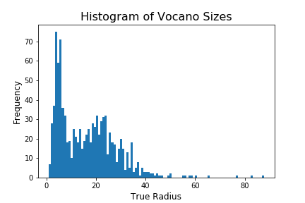<br>

On the first training run of this CNN with this dataset I ran it for the same amount of epochs that I used to train this similar architecture for binary classification. It showed not much learning:<br>
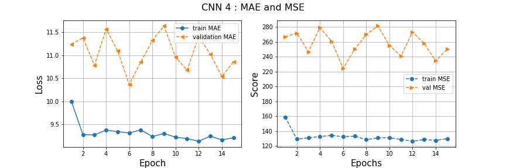<br>

This architecture is much better at predicting if a volcano is in the picture, then predicting the radius of  volcanos. If we had as many samples for the regression as we did for the classification this may be a different story. <br>

I decided to run the model for many more epochs to see if this would eventually bring my MSE down.  <br>

Below is a plot of the first 100. <br>
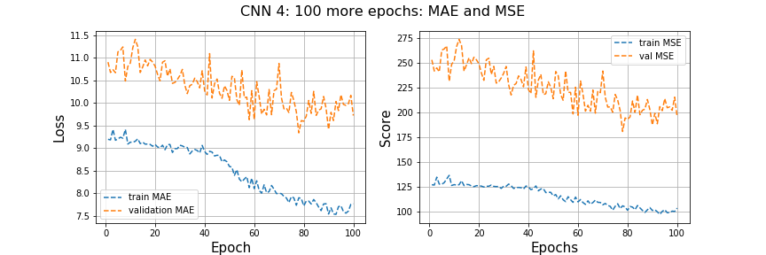<br>
It looks like the MSE may still come down so I fit again with 200 more epochs:<br>

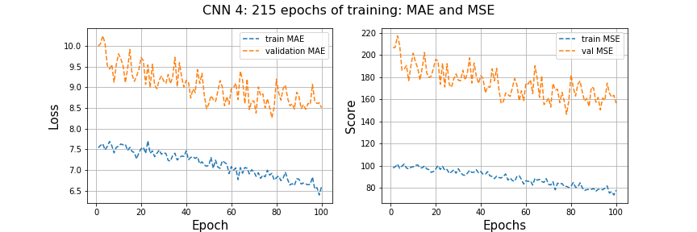<br>
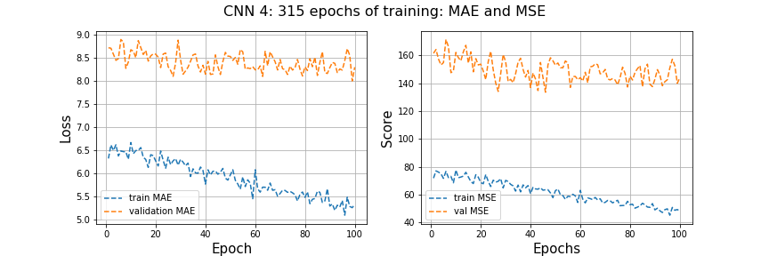
 <br>
 After over 315 epochs with this same architecture it seems that the validation scores are evening out and the train sores are going down. This might be a sign of overfitting. To try and get my MSE and MAE lower I would like to try two things and compare them: make a deeper CNN, and add augmentation to the training images.

 ### **Training a Deeper CNN** <br>
 I used the same architecture as before but added 2 additional layers of convultion with increasing filters, along with pooling and drop out for both layers. And I added another flattened layer with 24 nodes. The arechitecture is shown below.<br>
 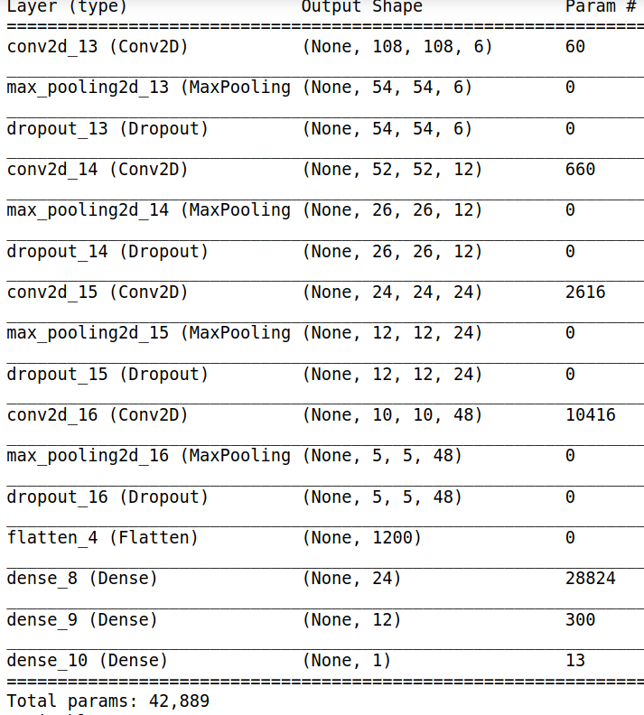<br>

 Below is a plot of the MAE and MSE of 200 epochs with this deeper CNN.<br>
 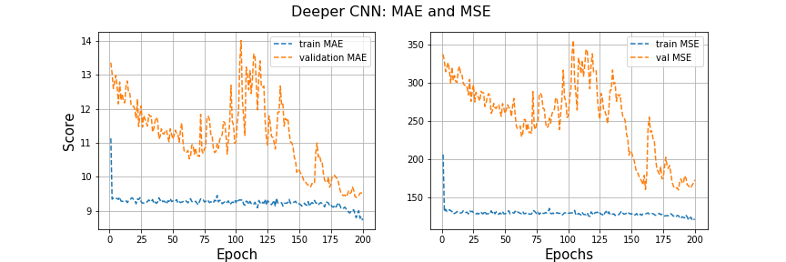<br>
This model seems like it is moving in the right diresction but the MSE at the end is still much higher then the MSE that the shallow CNN left off at. I will run the deep cnn for another 115 epoch to get it to the same training time as the shallow CNN for comparason.<br>

 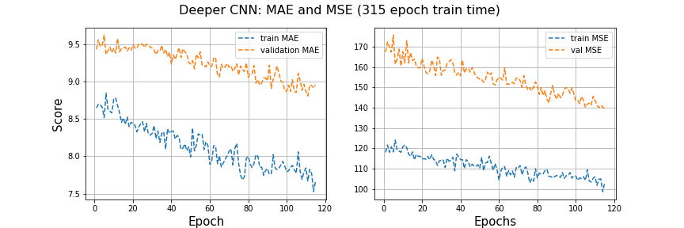<br>
After 315 epochs this model has now reached the same MSE as the shallow model , but this one seems to be still decreasing unlike the shallow model. This is promising but due to time contraints I will not be able to run for hundreds more epochs at this time. 


### **Trying Augmentation**<br>
Image augmentation is a way to give the training set more variation. In theory it helps with over fitting and general improvement of a model's prediction ability.<br>

I wrote a augmentation function that would take a batch of images and give them a chance of being flipped horazontaly, flipped verticaly, and  cropped.  I then created a generator function for this augmentation function that was use while fitting the CNN so that each batch of images fit would get a chance at augmentation. Below is a sample of the augmentation an image may go through. <br> 
<br>

Adding the augmentation generator to the input of the CNN **drastically** increased the fitting speed. Because of the time contraints on this project I decided to just pick two of the augmentation options, flip horazontally and crop. <br>
Below is a plot of 5 epochs of training with augmentation. This training with augmentation was done on the pretrained shallow model so I could compare the effects of deepening the network vs augmentation. 

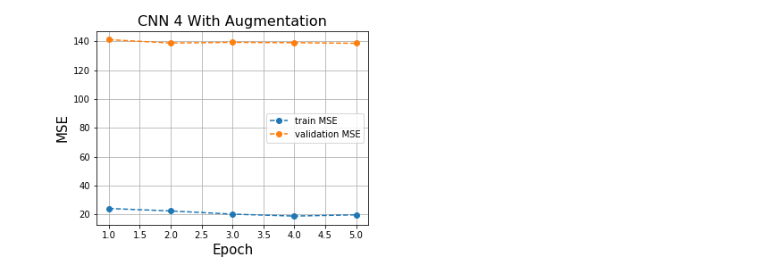<br>

The validation MSE seems to still be around 140. 
GIven more time I would let this shallow CNN train for much longer with the augmentation generator so see if the MSE can come down some more.  


### **Predicting radii on holdout data**
with deep network: **RMSE = 10.42** .......... **R^2 = .12**<br>
with augmentation: **RMSE = 11.08** ..........**R^2 =  .008**<br>

The deep network seemed to explain a little more varience in the data but in general both R^2 are very bad. The RMSE for both is around 11 which large considering the volcanoes span from about 5 pixels to 38 or so. 

<!--<br>-->
<br>

Below is a histogram of the true radii, and both model's predictions. I wanted to see if the model picked up on the different groups of volcanos but it apears that they are just predicting around the average.

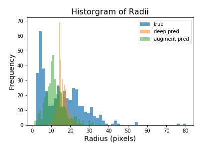<br>


________
# Conclution
 - A vary simple CNN did a great job at predicting the presence of a volcano in an image.  
 - This classification model could be trusted to aid in the work of planetary geologists and can be taylored for different ratios of false positives to false negatives by picking a apropriate threshold to apply to the output of the model.
 - The same architecture and training time did very poorly when adapted for use as a regression model to predict radii of volcanoes and wth the timealowed I was not able to make a good model for this aplocation. 
 - Moveing forward I believe a more useful models could be made to predict which group (large or small) a volcano is in. Or a model that does object detection so as to be able to check for one or more volcanoes anywhere in an image.
 


